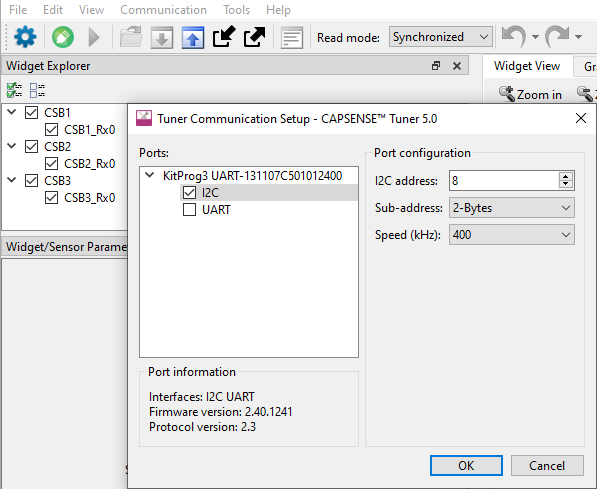
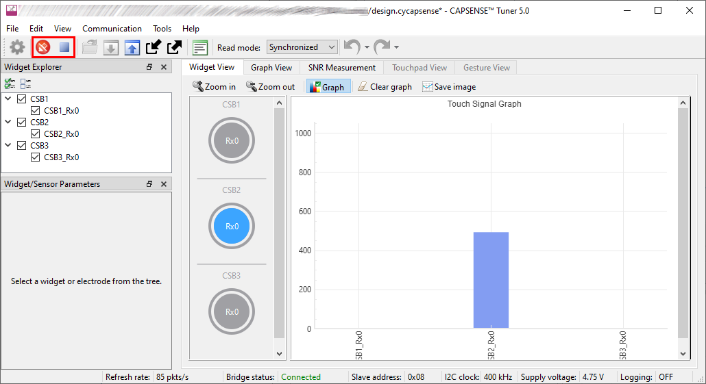
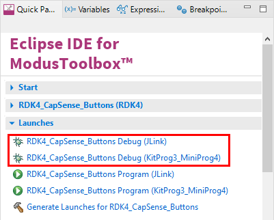

# RDK4 CAPSENSE™ Buttons

Rutronik Development Kit 3 Programmable System-on-Chip CY8C4149AZE-S598 "CAPSENSE Buttons" Code Example. 

This code example demonstrates the CAPSENSE™ buttons that are working in CSX mode.

 

## Requirements

- [ModusToolbox™ software](https://www.cypress.com/products/modustoolbox-software-environment) v3.0

### Using the code example with a ModusToolbox™ IDE:

1. Import the project: **File** > **Import...** > **General** > **Existing Projects into Workspace** > **Next**.
2. Select the directory where **"RDK4_CapSense_Buttons"** resides and click  **Finish**.
3. Update the libraries using a **"Library Manager"** tool.
4. Select and build the project **Project ** > **Build Project**.

### Operation

The firmware example uses a KitProg3 UART for debugging output and KitProg3 I2C for communication with a "CapSense Tuner" software. Only one peripheral may be used at a time. Use your preferred terminal software to track the debug output or simply load a ModusToolbox™ native "Terminal" tool.

The code example initializes the CAPSENSE™ peripheral and also the library that enables communication with a "CapSense Tuner" software via I2C. 

There are 3 CAPSENSE™ buttons CSB1, CSB2, and CSB3 onboard. After the firmware has started successfully the touch on any of the buttons should turn on and off the corresponding Red, Green or Blue LEDs in a D10 RGB LED package.

Launch the "CapSense Tuner" from the **Quick Panel** Tools section and select the I2C interface in the KitProg3 UART menu as it is shown:

Click on **Connect** and **Start** to establish the connection via I2C. Select all the slider sensors to be monitored in **Widget Explorer**.

### Debugging

If you successfully have imported the example, the debug configurations are already prepared to use with a the KitProg3, MiniProg4, or J-link. Open the ModusToolbox™ perspective and find the Quick Panel. Click on the desired debug launch configuration and wait for the programming to complete and the debugging process to start.

## Legal Disclaimer

The evaluation board including the software is for testing purposes only and, because it has limited functions and limited resilience, is not suitable for permanent use under real conditions. If the evaluation board is nevertheless used under real conditions, this is done at one’s responsibility; any liability of Rutronik is insofar excluded. 

